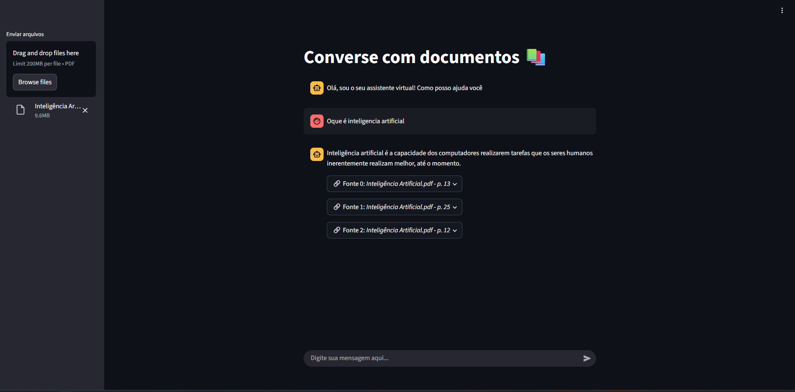
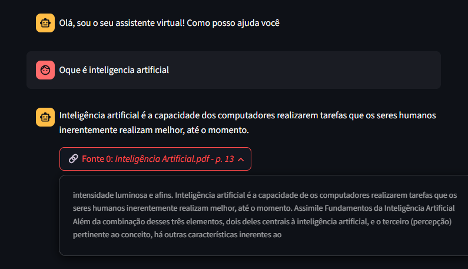
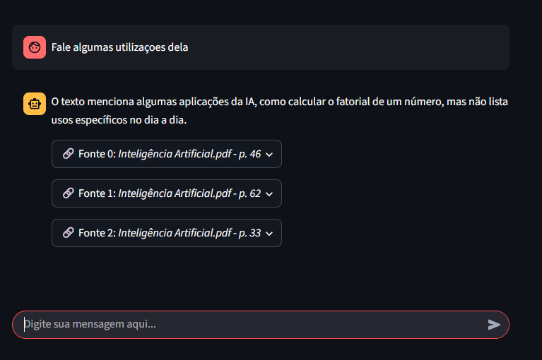
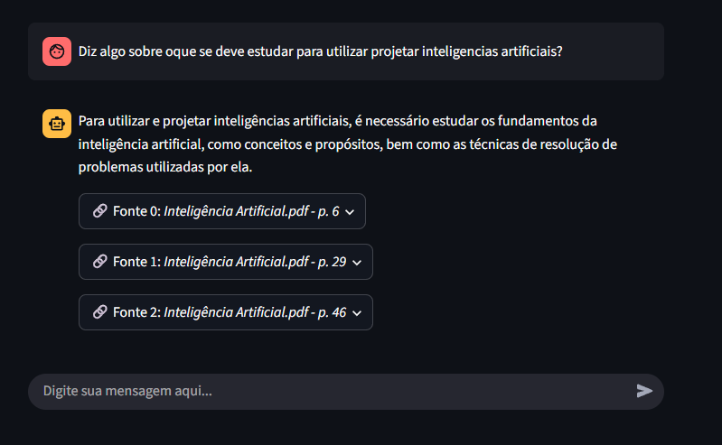

# 📚 Converse com Documentos

Este é um projeto de assistente virtual construído com **Streamlit** e **LLMs**, que permite que usuários interajam com documentos PDF, façam perguntas e recebam respostas com base no conteúdo dos arquivos enviados.

---

## ✨ Funcionalidades

- Upload de múltiplos arquivos PDF diretamente pela interface.
- Extração automática do conteúdo dos PDFs.
- Divisão dos textos em pedaços com sobreposição inteligente.
- Geração de embeddings usando modelos da Hugging Face.
- Armazenamento vetorial com FAISS.
- RAG (Retrieval-Augmented Generation) com histórico de chat.
- Interface intuitiva em português.
- Respostas com referências às páginas do documento original.

---

## 🖼️ Interface

### Tela Inicial
A interface solicita o envio de um ou mais documentos em PDF.  

### Exemplo de pergunta: "O que é inteligência artificial?"
O sistema fornece uma resposta direta com referências ao PDF enviado.  

### Utilizações da IA
As respostas destacam onde o conteúdo foi encontrado no documento.  

### O que estudar para projetar IAs
O sistema responde com base nas páginas relevantes do PDF.  

---

## 🧠 Modelos utilizados

- `gemma2-9b-it` (via ChatGroq)
- Alternativa: `moonshotai/kimi-k2-instruct`
- Embeddings: `BAAI/bge-m3`

---

## 🛠️ Tecnologias

- [Streamlit](https://streamlit.io/)
- [LangChain](https://www.langchain.com/)
- [FAISS](https://github.com/facebookresearch/faiss)
- [Hugging Face Transformers](https://huggingface.co/)
- [Groq LLM API](https://console.groq.com/)
- [Python-dotenv](https://pypi.org/project/python-dotenv/)

---

## 📌 Observações

- O tempo de resposta pode variar de acordo com:
  - O tamanho dos arquivos PDF enviados.
  - A complexidade da pergunta feita.
  - O modelo de linguagem escolhido.
- A aplicação funciona inteiramente em português.
- Arquivos enviados são processados temporariamente e não ficam salvos permanentemente.
- Cada pergunta considera o histórico do chat, melhorando a continuidade da conversa.
- O código é modular e permite fácil adaptação para outros contextos (ex: atendimento jurídico, educacional, etc).

---

## 🧪 Possíveis melhorias futuras

- 🔍 **Destaque de trechos usados na resposta:** mostrar visualmente qual parte do documento foi usada na resposta.
- 📁 **Suporte a outros formatos de arquivo:** como `.docx`, `.txt`, `.epub`, entre outros.
- 🧠 **Melhor desempenho com múltiplos documentos:** otimização na união e busca de informações em vários PDFs.
- 🧾 **Histórico persistente por usuário:** salvar conversas por sessão ou ID de usuário.
- 🗃️ **Integração com bancos de dados externos:** como PostgreSQL ou MongoDB.
- 📊 **Dashboard de estatísticas de uso:** quantidade de perguntas, tempo de resposta, documentos mais usados, etc.
- 🌐 **Interface multilíngue:** permitir conversas em outros idiomas além do português.

---
